**Míriam Núñez García**
# Modelo logico relacional

Crear el esquema de la BDD del diseño lógico utilizando el software MySql Workbench correspondiente al modelo conceptual de:

- La empresa de viveros (Carpeta Viveros).

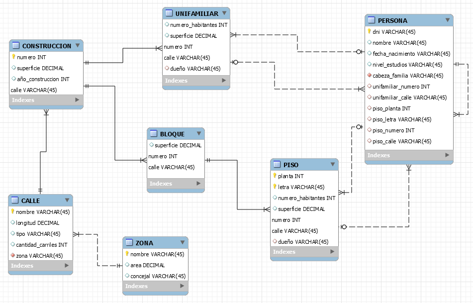

- La Base de Datos del Catastro (Carpeta Catastro).

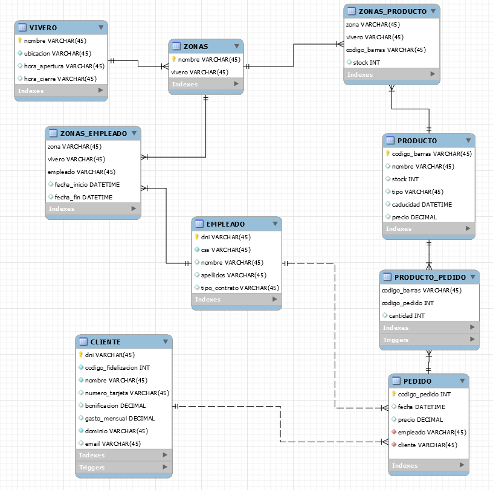

# Triggers

## 1. Trigger para crear email (VIVERO)

En primer lugar, creamos el procedimiento *crear_email*.

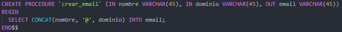

Después, creamos le trigger que se ejecutará antes de insertar los valores en la tabla *CLIENTE*.

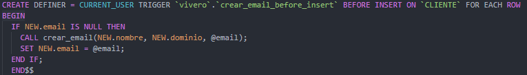

Como podemos ver en la siguiente imagen, en las dos primeras filas no se insertó el campo del email, así que se formó automáticamente, mientras que en la tercera, sí que se insertó.

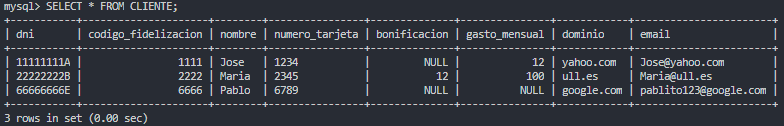

## 2. Trigger para comprobar que una persona no vive en dos viviendas (CATASTRO)

Para comprobar que una persona no pueda tener en la base de datos que vive en un piso y en una vivienda unifamiliar a la vez, utilizamos el siguiente trigger.

Nos encontramos con el caso de insertar una persona nueva:

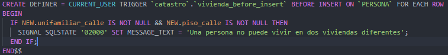

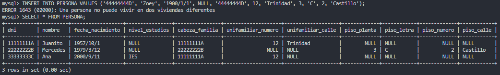

Y el caso de actualizar una persona existente:

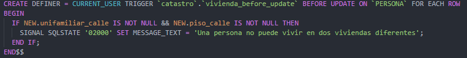

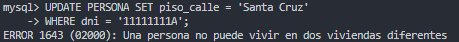

## 3. Trigger para actualizar el stock (VIVERO)

Para mantener actualizado el stock controlamos las inserciones en la tabla *PRODUCTO_PEDIDO*, ya que si un producto forma parte de un pedido el stock de este disminuirá. Utilizaremos esto para las dos tablas que tienen el atributo *stock*.

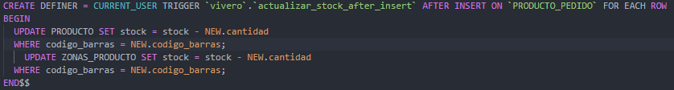

Como vemos en la diferencia entre las tablas iniciales:

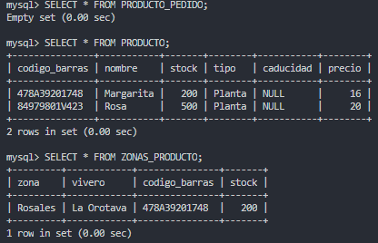

Y las tablas que quedan como resultado de insertar valores en la tabla *PRODUCTO_PEDIDO*, los valores disminuyen.

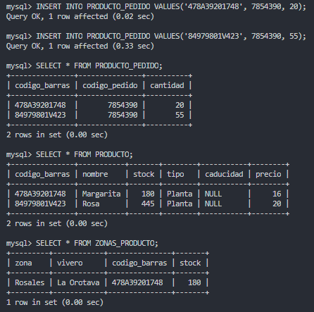
